# Recipe Crisps
A generic recipe search/maker android application, using Spoonacular API. 

This is a group project that we had proposed to our professor, as part of our Mobile Computing course. 

## Virtual Device Used
- `Pixel 3 API 30`

# Cloning the Repository
** **Note!** This app uses Firestore database, you must first ensure that you have enabled it in your Firebase console.

1. Go to your preferred directory
2. Open your terminal and type `git clone git@github.com:laazyCmd/recipe-crisps.git`
3. Import the folder using either `Android Studio` or `IntelliJ`
4. Wait for `gradle` to build the project
5. Before starting the app, ensure:
   - You have your Firebase's `google-services.json` to the `/app` directory
   - You have added your own Spoonacular API Key to `spoonacularAPI_Key` string, in the `/app/src/main/java/com/cite306/project/util/Util` interface
   - You have added your own GitHub ID and Personal Access Token in `/github.properties`

# How to Interact
- `Click` to see the information of a queried or user-made recipe
- `Long Click` to edit a user-made recipe
- `Click & Drag` to drag a queried ingredient inside or outside when making/updating a recipe

# Screenshots
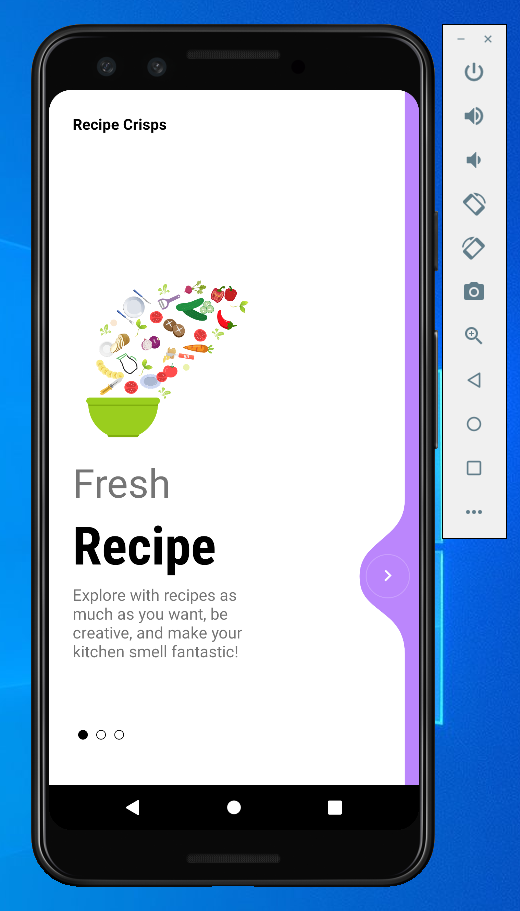
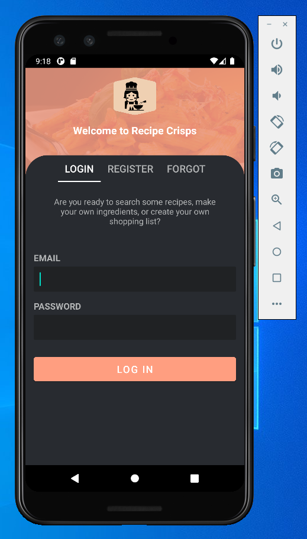
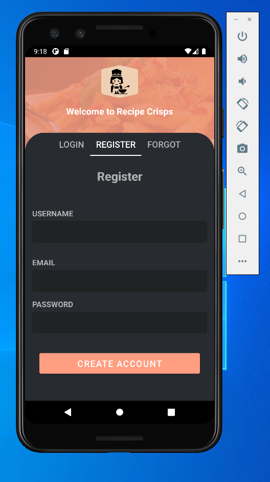
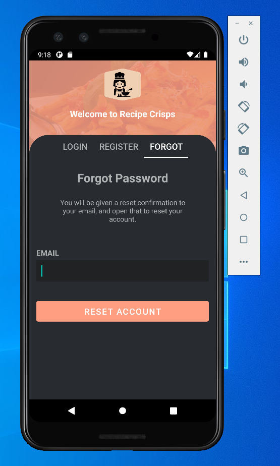
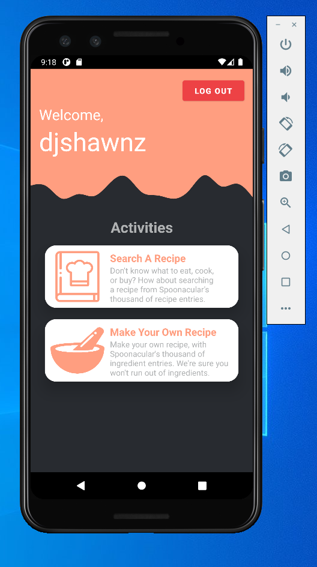
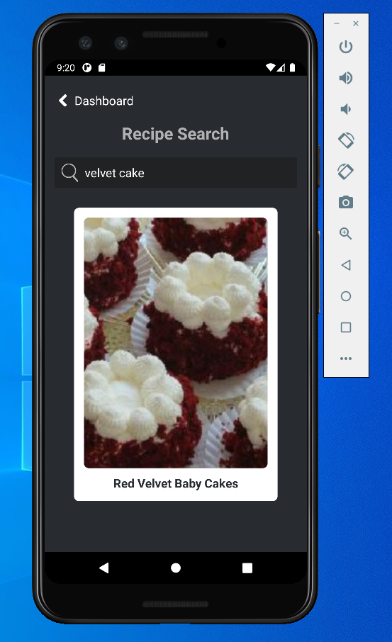
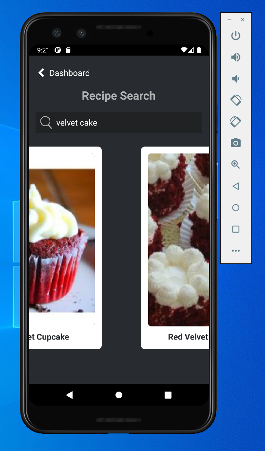
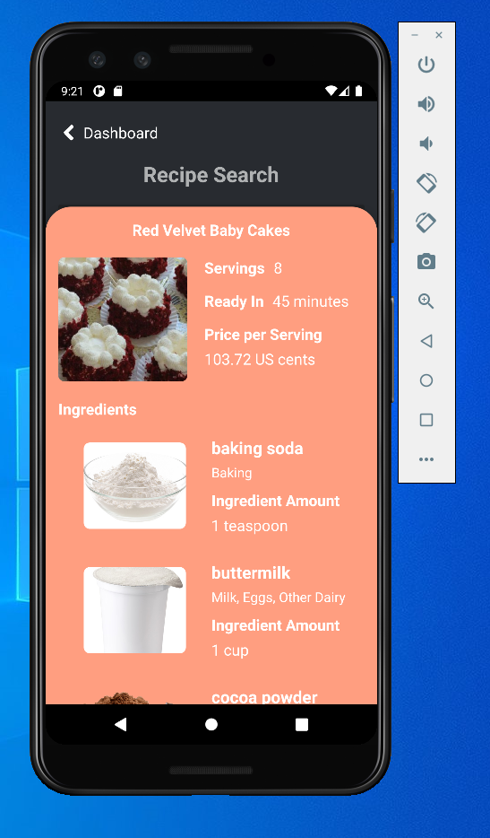
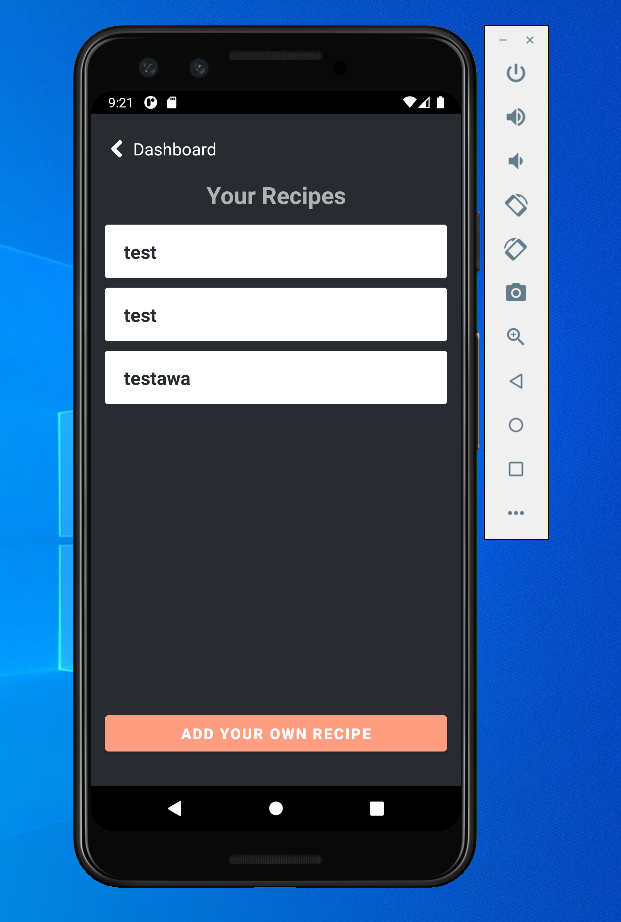
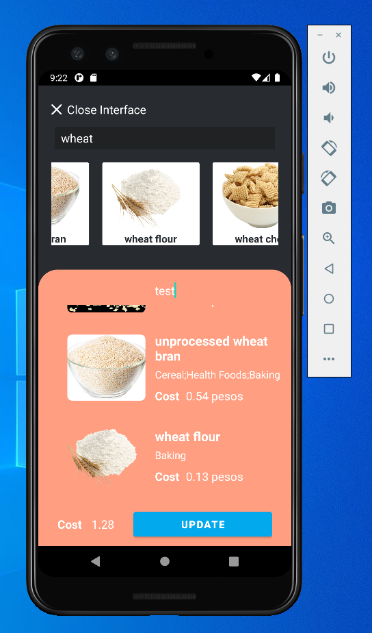
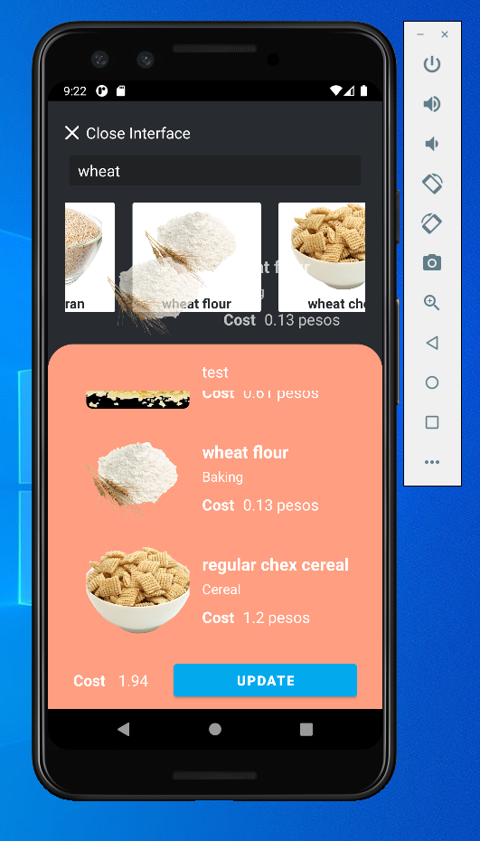
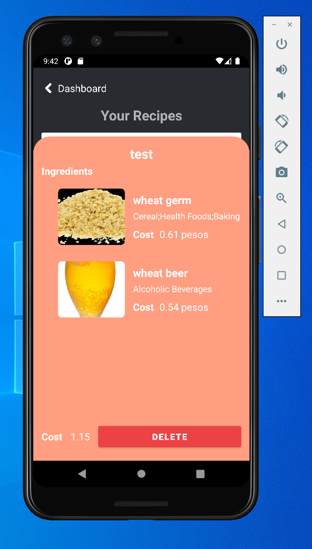
